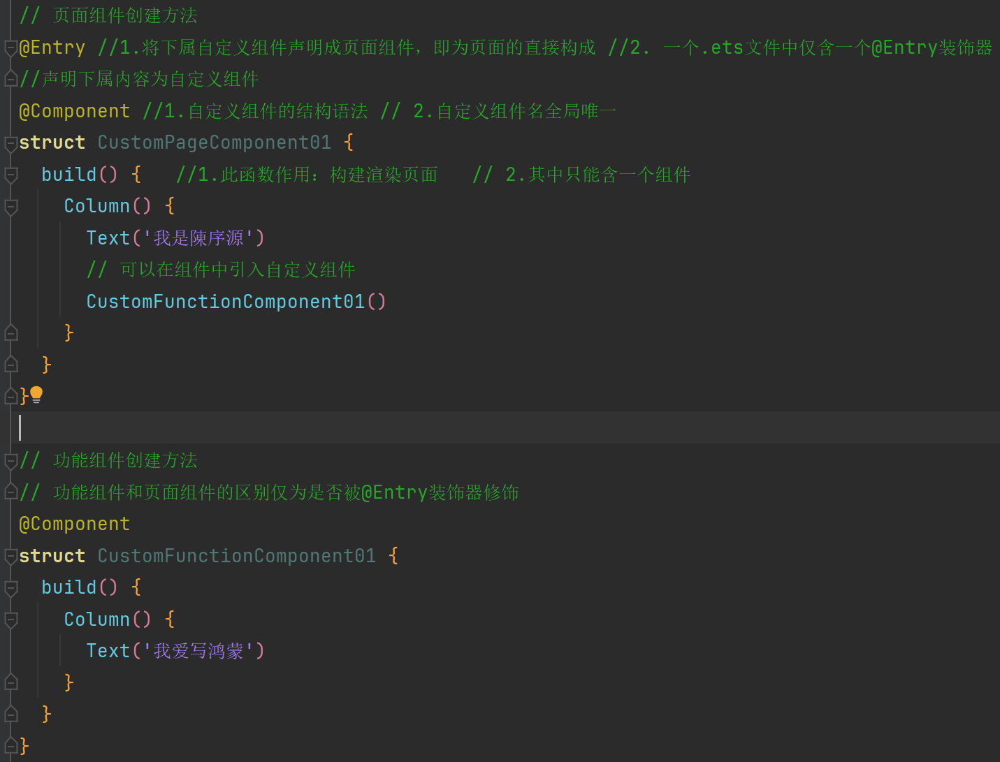
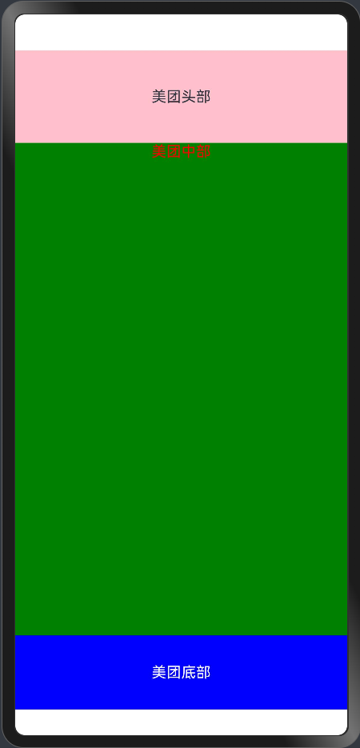
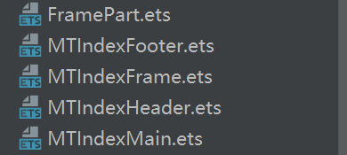
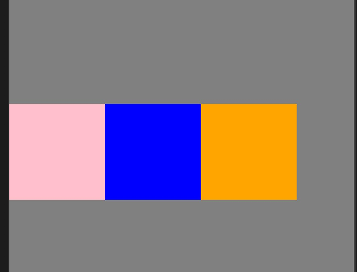
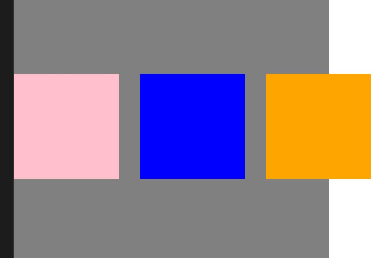
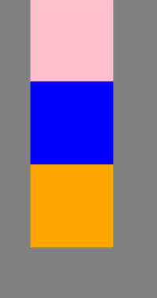
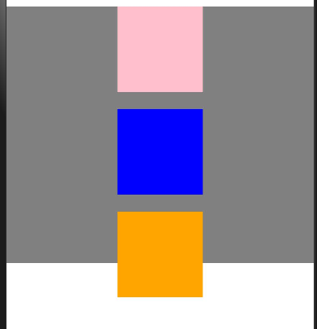

# HarmonyOS 基础

> 参考文档：
>
> [黑马笔记参考](https://www.yuque.com/panpu-1quqj/hgpwdy/ygtovgxtgbubgp80)

## 组件基础

### 1. 组件概念

鸿蒙页面中的所有内容都可称之为**组件**：本质是一个`.ets`的文件。

在概念上可以划分成二部分：1. **页面组件** 2. **功能组件**

**区别**：页面组件指一个**完整的页面**。功能组件一般**存在于**页面组件中，作为其中一部分展示

> **官方相关定义：**
>
> 1. UI显示的内容均为组件。系统提供的称为**系统组件**，用户定义的称为**自定义组件**
> 2. **页面**由一个或多个自定义组件构成
>
> [参考链接](https://developer.huawei.com/consumer/cn/doc/harmonyos-guides-V5/arkts-create-custom-components-V5)

### 2. 页面组件的基础结构



### 3. 组件的使用

组件的使用形式类似函数：`组件名()`

- 若有**构成参数**则可：`组件名(参数)`
- 若为**容器组件**则可放入子组件：`组件名(){ 子组件() }`
- 若需**配置属性**则可：`组件名().属性名( 属性值 )`

### 4. 组件解耦与复用

前文中提及多个自定义组件可写入在同一`.ets`文件中后调用。这种写法局限于**调用者只能是同一文件的其他组件**。

**解决方法**：使用ES6的导入导出语法；将组件导出即可别其他文件组件引入使用，但最好具有一定的规范。

**规范**：

1. 仅在单个页面使用的自定义组件可以存在于同一`.est`文件中
2. 若被多个页面引入的自定义组件则最好单独定义一个`.ets`文件内

> 导入导出语法参考：
>
> [本文参考](#导入与导出)

#### 4.1 美团主页框架案例

实现如下效果来体会组件解耦与复用的概念



**文件结构：**



- MTIndexHeader：美团首页布局骨架头部

  ```ts
  @Preview
  @Component
  export  struct MTIndexHeader {
    build() {
      Row(){
        Text('美团头部')
      }
        .backgroundColor(Color.Pink)
        .height(100)
        .width('100%')
        .justifyContent(FlexAlign.Center)
    }
  }
  ```

- MTIndexMain：美团首页布局骨架主体

  ```ts
  @Preview
  @Component
  export  struct MTIndexMain {
    build() {
      Row(){
        Text('美团中部')
          .fontColor(Color.Red)
      }
      .backgroundColor(Color.Green)
      .height('100%')
      .width('100%')
      .justifyContent(FlexAlign.Center)
      .alignItems(VerticalAlign.Top)
    }
  }	
  ```

- MTIndexFooter：美团首页布局骨架底部

  ```ts
  @Preview
  @Component
  export  struct MTIndexFooter {
    build() {
      Row(){
        Text('美团底部')
          .fontColor(Color.White)
      }
      .backgroundColor(Color.Blue)
      .height(80)
      .width('100%')
      .justifyContent(FlexAlign.Center)
    }
  }
  ```

- FramePart：便于引入

  ```ts
  import {MTIndexHeader} from './MTIndexHeader'
  import {MTIndexMain} from './MTIndexMain'
  import {MTIndexFooter} from './MTIndexFooter'
  
  export {MTIndexHeader,MTIndexMain,MTIndexFooter};
  ```

- MTIndexFrame：美团首页架构

  ```ts
  import { MTIndexFooter,MTIndexHeader,MTIndexMain } from './FramePart'
  @Entry
  @Component
  struct MTIndexFrame {
    build() {
      Column(){
        MTIndexHeader()
        MTIndexMain()
          .layoutWeight(1)
        MTIndexFooter()
      }
      .width('100%')
      .height('100%')
    }
  }
  ```

  

## 布局

### 1. 线性布局 (Row/Column)

> 参考文档：
>
> [指南](https://developer.huawei.com/consumer/cn/doc/harmonyos-guides-V5/arkts-layout-development-linear-V5)
>
> [API参考](https://developer.huawei.com/consumer/cn/doc/harmonyos-references-V5/ts-container-column-V5)

线性布局顾名思义即容器组件中的子组件会呈线性排列。具体容器组件为：Row，Column

#### **1.1 Row**

**特性**：

1. 子元素呈横向排列

   

2. 若设置高度，则子组件会有**垂直居中**的特性

3. 子组件超过父容器宽带时不会换行而是溢出显示。

   

#### **1.2 Column**

**特性**：

1. 子元素呈竖向排列

   

2. 若设置宽度，则子组件会有**水平居中**的特性

3. 子组件超过父容器宽带时不会换行而是溢出显示。

   


#### 1.3 主轴与交叉轴

以Column组件为例：其主轴方向为**垂直**，交叉轴为**水平**。

通过 ` justifyContent `属性来设置主轴子组件的排列方式

通过 ` alignItems `属性来设置交叉轴子组件的排列方式

 	1. 水平方向的交叉轴的取值是： [HorizontalAlign](https://developer.huawei.com/consumer/cn/doc/harmonyos-references-V5/ts-appendix-enums-V5#horizontalalign) 类型 
 	2. 垂直方向的交叉轴的取值是：  [VerticalAlign](https://developer.huawei.com/consumer/cn/doc/harmonyos-references-V5/ts-appendix-enums-V5#verticalalign)  类型 

#### 1.4 其他特性

**组件间距**

可以通过设置 线性容器组件的构造形参对象的 `space` 属性来调整子组件之间的距离

**自适应拉伸**

使用 `Blank` 组件可在主轴方向上自动填充空白区域

**自适应缩放**
使用 `layoutWeight` 属性来配置 子组件之间在其主轴上的权重占比

### 2. 层叠布局 (Stack)

> 参考文档：
>
> [指南](https://developer.huawei.com/consumer/cn/doc/harmonyos-guides-V5/arkts-layout-development-stack-layout-V5#%E6%A6%82%E8%BF%B0)
>
> [API参考](https://developer.huawei.com/consumer/cn/doc/harmonyos-references-V5/ts-container-stack-V5)

使不同的组件间具有层级的概念，可以堆叠在一起。

**对齐方式**
可以通过 Stack的 构造参数对象的  [alignContent参数](https://developer.huawei.com/consumer/cn/doc/harmonyos-references-V5/ts-container-stack-V5#aligncontent) 来调整子组件的对齐方式。

**Z轴控制**

其子组件的层叠顺序可以通过 `zIndex` 属性来控制，越大越处于上方。

**位置微调**
通过 [offset](https://developer.huawei.com/consumer/cn/doc/harmonyos-references-V5/ts-universal-attributes-location-V5#offset)  通用属性来微调位置。offset可根据坐标轴对象调整，其原点为组件自身位置左上角

#### 2.1 抖音迷幻文字案例

效果图：


实现代码：

```ts
@Entry
@Component
struct DouYinStackCase {

  build() {
    Stack(){
      Text('抖音').
      fontWeight(700).fontSize(80).fontColor(Color.Orange)
        .zIndex(2)
        .offset({x:4,y:4})
      Text('抖音')
        .fontWeight(700).fontSize(80).fontColor(Color.Black)
        .zIndex(3)
      Text('抖音')
        .zIndex(1)
        .fontWeight(700).fontSize(80).fontColor(Color.Blue)
        .offset({x:-4,y:-4})
    }
    .height('100%')
    .width('100%')
  }
}
```

### 3. 弹性布局 (Flex)

> 参考文档：
>
> [指南](https://developer.huawei.com/consumer/cn/doc/harmonyos-guides-V5/arkts-layout-development-flex-layout-V5#%E6%A6%82%E8%BF%B0)
>
> [API参考](https://developer.huawei.com/consumer/cn/doc/harmonyos-references-V5/ts-container-flex-V5)
>
> [Flex相关属性API参考](https://developer.huawei.com/consumer/cn/doc/harmonyos-references-V5/ts-universal-attributes-flex-layout-V5)

弹性布局和线性布局非常类似，其对比具有以下特点：

* 默认主轴是**横轴**，但是可切换修改
* 当一行无法容纳子组件时，会**弹性修改**所有子组件的宽度，使其都处于可视范围内。
* 当一行无法容纳子组件时，可设置换行属性为true，即可**自动换行**

**构造形参&属性**

- **设置布局方向**

   `direction` 参数修改主轴方向

- **设置换行**

   `FlexWrap` 参数设置是否换行

- **单个子组件设置交叉轴对齐方式**

   通过子组件的 [alignSelf](https://developer.huawei.com/consumer/cn/doc/harmonyos-references-V5/ts-universal-attributes-flex-layout-V5#alignself) 属性设置。且**优先级**高于父组件的的设置

### 4. 网格布局 (Grid/GridItem)


# JavaScript 语法

## 导入与导出

导出可分为：**默认导出，命名导出，批量导出，重新导出**

导入可分为：**导入默认导出，导入命名导出，重命名导入，导入所有导出**

### 1.1 **默认导出**

- 可以使用`export default`关键字来导出一个模块中的单个值，这个值可以是一个函数、类、对象或基本类型等

- 每个模块只能有一个默认导出。

-  示例： 

  ```js
  // myModule.js
  export default function() {
    console.log('Hello World!');
  }
  ```

### 1.2 **命名导出**

- 使用`export`关键字后面跟变量名、函数名或者类名来进行命名导出。

- 每个模块可以有多个命名导出。

-  示例： 

  ```js
  // myModule.js
  export const name = 'Alice';
  export const age = 25;
  export function sayHello(name) {
    console.log(`Hello, ${name}!`);
  }
  ```

###  1.3 **批量导出**

- 可以在一个`export`语句中导出多个值。

-  示例： 

  ```js
  // myModule.js
  const name = 'Alice';
  const age = 25;
  function sayHello(name) {
    console.log(`Hello, ${name}!`);
  }
  export { name, age, sayHello };
  ```

### 1.4 **重新导出**

- 如果一个模块只是作为一个中介，用来从其他模块导入并再次导出某些值，可以使用`export ... from`语法。

-  示例： 

  ```js
  // anotherModule.js
  export { name, age } from './myModule.js';
  ```

### 2.1 **导入默认导出** 

- 使用`import`关键字后跟任意名称来导入默认导出的值。

-  示例： 

  ```js
  // app.js
  import greet from './myModule.js';
  greet(); // 输出: Hello World!
  ```

### 2.2  **导入命名导出** 

- 使用大括号`{}`来指定要导入的具体命名导出值。

-  示例： 

  ```js
  // app.js
  import { name, sayHello } from './myModule.js';
  sayHello(name); // 输出: Hello, Alice!
  ```

### 2.3   **重命名导入**  

- 可以使用`as`关键字来为导入的值指定一个别名。

- 示例： 

  ```js
  // app.js
  import { name as userName, sayHello as greet } from './myModule.js';
  greet(userName); // 输出: Hello, Alice!
  ```

### 2.4    **导入所有导出**   

- 使用星号`*`和`as`关键字来导入模块中所有的导出值到一个对象中。

- 示例： 

  ```js
  // app.js
  import * as myModule from './myModule.js';
  myModule.sayHello(myModule.name); // 输出: Hello, Alice!
  ```


